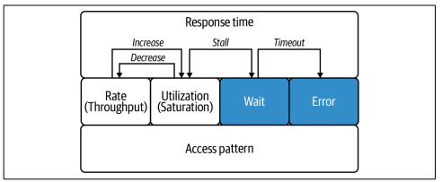

# Chapter 6. Server Metrics
* MySQL 메트릭은 성능과 밀접한 관련이 있다
* MySQL 성능은 메트릭의 스펙트럼을 통해 확인해야 한다
* 워크로드를 실행하면 메트릭의 결과는 MySQL이 아닌 워크로드의 속성을 나타낸다
* MySQL 성능을 이해하고 분석하는 데 필요한 메트릭은 극히 일부에 불과하다
## Query Performance Versus Server Performance
* 이 장에서는 MySQL 자체의 성능을 이야기한다
### Concurrency and contention
* Concurrency는 쿼리 성능을 떨어뜨리는 Contention으로 이어진다
* 쿼리는 단독으로 실행될때와 다른 쿼리와 함께 실행될 때 다른 성능을 보여준다
* contention은 성능을 떨어뜨리고, 동시성은 contention을 증가시킨다
### Tuning
* 서버 성능은 전적으로 워크로드 떄문만은 아니다
* MySQL, 운영체제, 하드웨어도 영향을 미친다
* 쿼리가 적절하다고 가정할 때 하드웨어, 운영체제, MySQL도 영향을 미치겠지만 튜닝을 해야 한다면 워크로드를 통해 서버의 성능을 분석해야 한다
### Performance regressions
* 모든 것을 확인하고 나면 최후의 수단으로 Performance regression을 의심한다(또는 버그)
## Normal and Stable: The Best Database Is a Boring Database
* 애플리케이션과 워크로드가 MySQL에서 실행되는 방식에 익숙해지면 엔지니어 대부분은 normal과 stable을 직관적으로 이해한다
* 인간은 패턴 인식에 능숙해서 어떤 메트릭을 보여주는 차트가 정상인지 비정상인지 쉽게 알 수 있다
### Normal
* 정상이란 모든 것이 제대로 작동하는 평상 시 애플리케이션에 대해 MySQL이 보이는 모든 성능이다
* 정상은 성능의 일부 측면이 평소와 어떻게 다른지를 결정하는 기준선이 된다
### Stable
* 한계까지 짜내면 성능이 불안정해지기 때문에, 안정성은 성능을 제한하는 것이 아니다
* 모든 수준에서 지속 가능한 성능을 보장한다
* 모든 쿼리가 빠르게 응답하고 메트릭이 안정적이고 정상적이며 모든 사용자가 만족하는 상태를 의미한다
## Key Performance Indicators
### Response time
* 응답 시간은 모두가 관심을 두는 유일한 지표이다
* 그러나 다른 지표도 함께 고려해야 한다, 성공률이 0이고 응답 시간이 0에 수렴한다면 정상이 ㅇ아니다
* 목표는 정상이면서 안정적인 응답 시간이며, 낮을수록 좋다
### Errors
* 오류는 쿼리 오류뿐 아니라, 쿼리, 연결, 클라이언트, 서버와 같은 모든 오류를 포함한다
* 0은 기대하지 말자, 그러나 0에 가까울 수록 좋다
### QPS
* QPS는 성능을 나타내지만 그 자체가 성능은 아니다
* 비정상적으로 높은 QPS는 문제일 수도 있다(모두 실패해서 항상 빠르게 응답하는 쿼리)
* 목표는 정상이고 안정적인 QPS이며 목푯값은 그때마다 다르다
### Threads running
* MySQL이 QPS를 달성하기 위해 얼마나 노력하는지를 측정한다
* 하나의 스레드는 하나의 쿼리를 실행한다
* 이 주요 메트릭 4가지는 MySQL의 핵심 성능 지표이므로 이 4가지 값은 항상 모니터링하자
## Field of Metrics
* 모든 MySQL 메트릭은 아래 6개 클래스 가운데 하나에 속한다
* 
* MySQL 성능은 분리된 속성이 아니므로 하나의 메트릭만으로 완전히 이해할 수 없다
### Response Time
* 응답 시간은 MySQL이 응답하는 데 걸리는 시간을 나타낸다
* 하위 수준의 세부사항을 포함하므로 메트릭 필드에서 최상위 수준이다
* 그렇기에 불투명하므로 이에 대해 더 자세히 이해해야 한다
### Rate
* 속도는 MySQL이 개별 작업을 얼마나 빨리 완료하는지를 나타낸다
* 속도가 증가하면 일반적으로 사용률을 높일 수 있다
* 
### Utilization
### Wait
### Error
### Access Pattern
### Internal
## Spectra
### Query Response Time
### Errors
### Queries
### Threads and Connections
### Temporary Objects
### Prepared Statements
### Bad SELECT
### Network Throughput
### Replication
### Data Size
### InnoDB
## Monitoring and Alerting
### Resolution
### Wild Goose Chase (Thresholds)
### Alert on User Experience and Objective Limits
### Cause and Effect
## Summary
## Practice: Review Key Performance Indicators
## Practice: Review Alerts and Thresholds