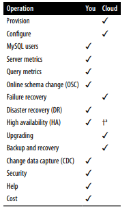

# Chapter 10. MySQL in the Cloud
* 클라우드에서 MySQL을 사용할 때 알아야 할 사항을 알아본다
## Compatibility
* Mysql, Oracle, Percona, MariaDB는 유사하지만 조금씩 다르다
* Code compatibilty는 각각이 동일한 코드인지의 여부이다
* Feature compatibility는 클라우드 공급자나 MySQL 배포판 외부에서 사용할 수 없는 기능을 포함하는지 여부
* 엔터프라이즈 고유의 기능에 의존하면 다른 배포판으로 마이그레이션 할 수 없음을 의미한다
## Management (DBA)
* 
* 각각의 작업을 누가 주관하는가
* HA의 경우 DR과 Failure Recovery라는 두가지 작업을 포함하기 때문에 양쪽 모두에 요구된다
## Network and Storage…Latency
* 클라우드는 지연 시간이 길고 안정성이 낮다
* 네트웤 지연은 MySQL 외부에서 발생하므로 실제 쿼리 프로파일과 응답시간이 일치하지 않기도 한다
* 클라우드에서 MySQL을 사용하면 네트워크 스토리지로 인해 SSD의 장점을 크게 가져갈 수 없다
* 그러나 넷플릭스와 같은 거대한 규모도 클라우드에서 운영된다, 중요한 건 어떻게 컨트롤 할 지이다
## Performance Is Money
* 클라우드 상의 대부분의 MySQL은 과도하게 프로비저닝 됭 있다
* 클라우드의 자원은 부분적인 증가가 어렵고 2배로 증설해야 하고 비용도 ㄷ2배가 ㅇ된다
* 클라우드의 모든 것은 비용이므로 비용을 조사하고 정확하게 이해해야 한다
* 클라우드 공급자는 할인을 하므로.. Reserve 해서 사용하자
