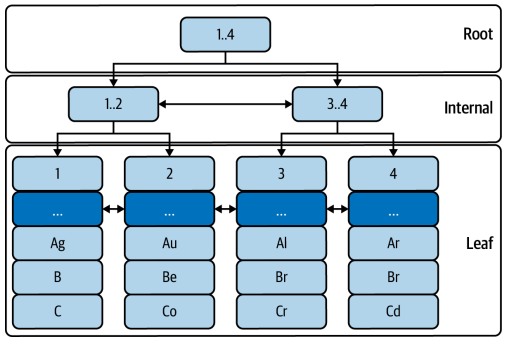
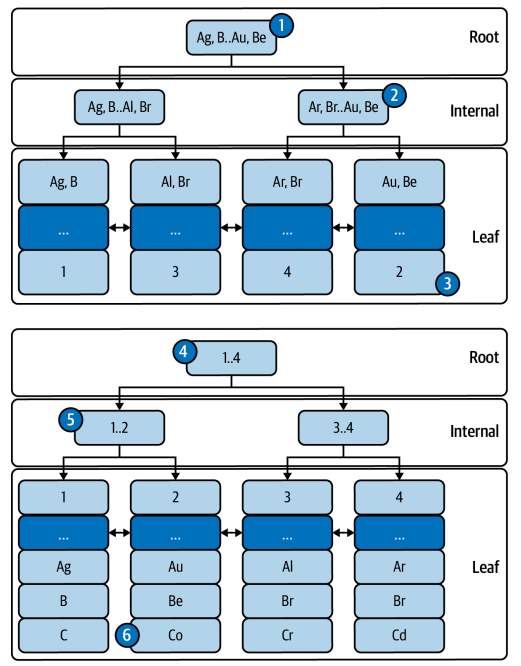

# Chapter 2. Indexes and Indexing
* MySQL의 성능 핵심은 인덱스다
* Optimization은 MySQL의 하드웨어를 효율적으로 만드는 여러 기술들이다.
* 그러나 결국 Index 없이는 상수로 밖에 증가할 수 없다.
* 여기서 Index가 지수 증가를 이끌어내는 핵심이 된다.

## 2-1 Red Herrings of Performance
### Better, Faster Hardware!
* Scale up은 당장에는 도움이 되겠지만, 실제 원인과 그에 대한 해결책이 될 수는 없다
* 그렇지만 예를 들어 리소스의 크기가 비대칭이거나 실제로 사용량이 급증하여 당장 크기를 늘려야 한다면 예외가 될 수 있다
* 그러나 이것은 지속 가능한 접근 방식이 아니다

### MySQL Tuning
* Tuning은 MySQL 시스템 변수를 조정하여 성능을 개선하는 등의 행위다. 이것은 MySQL에 대한 Research에 가까운 행위이지 사용자인 우리가 해야할 일이 아니다
* Configuring은 시스템 변수를 하드웨어에 적합하게 구성하는 것
* Optimizing은워크로드를 줄이거나 효율성을 높여 MySQL의 성능을 향상시키는 것
* 그러나 Tuning은 실제 환경에서 적합하지 않은 극한의 상황을 가정하고 테스트 하는것ㅇ며 Configuration과 optimizing은 일반적으로 자동 최적화 되어있다 

## 2-2 MySQL Indexes: A Visual Introduction

### InnoDB Tables Are Indexes
```roomsql
CREATE TABLE `elem` (
 `id` int unsigned NOT NULL,
 `a` char(2) NOT NULL,
 `b` char(2) NOT NULL,
 `c` char(2) NOT NULL,
 PRIMARY KEY (`id`),
 KEY `idx_a_b` (`a`,`b`)
) ENGINE=InnoDB;

+----+------+------+------+
| id | a | b | c |
+----+------+------+------+
| 1 | Ag | B | C |
| 2 | Au | Be | Co |
| 3 | Al | Br | Cr |
| 4 | Ar | Br | Cd |
| 5 | Ar | Br | C |
| 6 | Ag | B | Co |
| 7 | At | Bi | Ce |
| 8 | Al | B | C |
| 9 | Al | B | Cd |
| 10 | Ar | B | Cd |
+----+------+------+------+
```
> elem table

> elem 테이블의 InnoDB B-트리 인덱스

* 1,2,3,4 가 primary 키로 값을 달고 있다
* Primary key lookup은 매우 빠르고(extremely fast) 효율적이다
* Primary eky는 MySL 성능에서 핵심(pivotal) 역할을 한다


```roomsql
SELECT * FROM elem WHERE a='Au' AND b='Be';
```
* 이 쿼리를 실행한다고 가정해보면

> "Au, Be" 값에 대한 세컨더리 인덱스 조회

1. secondary index의 root에서 부터 B-Tree를 검색하여 primary key 값을 찾는다. O(log n)
2. 찾은 primary key 값 2를 가지고 다시 primary index에서 B-Tree를 검색한다. O(log n)
3. 찾은 값을 반환한다.
> 따라서 시간 복잡도는 O(2 log n) 으로 -> O(log n)으로 수렴한다.


### Table Access Methods
* Index lookup : MySQL의 행식임 정렬된 구조와 접근 알고리즘을 통해 빠르고 효율적인 접근
* Index scan
  * Index 조회가 불가능 할때 모든 행을 순차적으로 읽어 나간다
  * 그러나 primary key의 행이 sequential read라고 해서 disk에서도 sequential인 것은 아니며 대부분 random access가 발생한다 
  * 단순히 정렬된 파일보다도 더 느린 접근이 된다는 의미
* Table scan
  * Primary key 순서로 모든 행을 읽는다

### Leftmost Prefix Requirement
* Index를 사용하려면 가장 왼쪽 Index 열로 시작하는 하나 이상의 Index열을 반드시 사용해야 한다
* Index(a,b,c) 라면 Where절에 a를 포함하지 않은 경우 index가 사용되지 않는다
* Index(a,b)와 Index(b,a)는 다르다.
* Index(a) secondaryIndex(b,c)인 경우 사실 secondaryIndex(는 b,c,a)이다
* 그렇다고 해서 secondaryIndex(b,c,a)로 선언하면 a field가 중복되어 index가 커진다

### EXPLAIN: Query Execution Plan
* MySQL이 쿼리를 실행하는 방법을 설명하는 query execution plan을 보여준다
```roomsql
EXPLAIN SELECT * FROM elem WHERE id = 1\G;

*************************** 1. row ***************************
 id: 1
 select_type: SIMPLE
 table: elem
 partitions: NULL
 type: const
possible_keys: PRIMARY
 key: PRIMARY
 key_len: 4
 ref: const
 rows: 1
 filtered: 100.00
 Extra: NULL
```
* table : 테이블 이름 또는 참조된 서브 쿼리, MySQL이 결정한 조인 순서로 나열됨
* type : 테이블 접근 방법이나 인덱스 조회의 접근 유형, ALL : full sacn, index : index scan, const, ref, range등도 있다(index 조회의 접근 유형)
* possible_keys : 사용할 수 있는 index를 나열한다
* key : 사용할 인덱스의 이름, 없으면 NULL
* ref : Index에서 행을 조회하는 데 사용되는 값의 소스
* rows : 일치하는 행을 찾기 위해 조회할 예상 행의 수, 근사값
* Extra : 쿼리 실행 계획에 대한 부가 정보
### WHERE
* table condition은 row와 value로 이루어지며, 일치하거나 조건에 따라 row를 그룹화하고 집계 정렬하기 위해 사용
```roomsql
EXPLAIN SELECT * FROM elem WHERE id = 1\G
- unique primary key를 사용하므로 상수화된 접근
EXPLAIN SELECT * FROM elem WHERE id > 3 AND id < 6 AND c = 'Cd'\G
- primary key를 범위로 접근하고 c는 index가 아니므로 상수더라도 상수화된 접근이 아니다
EXPLAIN SELECT * FROM elem WHERE a = 'Au'\G
EXPLAIN SELECT * FROM elem WHERE a = 'Au' AND b = 'Be'\G
- secondary index를 사용하여 상수값으로 접근하지만, unique가 아니므로 상수화된 접근은 아니다
EXPLAIN SELECT * FROM elem WHERE a = 'Al' AND c = 'Co'\G
- 조건에 일치하는 값이 없는 query 이지만 index에서 a='Al'을 3행 찾았으므로 EXPALIN에서 rows: 3을 반환
EXPLAIN SELECT * FROM elem WHERE b = 'Be'\G
- 맨 왼쪽 접두사 조건이 충족되지 않아 Index 접근하지 않는 쿼리
```
* type : ALL, possible_keys: Null or Key : Null 이면 쿼리를 멈추고 분석해야 한다
### GROUP BY
### ORDER BY
### Covering Indexes
### Join Tables