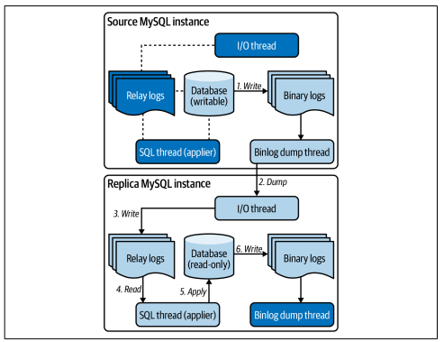

# Chapter 7. Replication Lag
* 복제 지연은 원본 MySQL 인스턴스에서 쓰기가 발생하는 시간과 복제 인스턴스에 적용되는 시간 사이의 지연이다
* 복제는 성능을 떨어뜨리지만 복제 없는 MySQL을 쓰고 싶어하는 사람은 없다
* 복제의 비용은 복제의 압도적인 이점으로 상쇄된다
## Foundation
* MySQL에느 2가지 유형의 복제가 있다
* Source to replica
  * 20년 이상 사용해 온 기본 복제 유형
* Group Replication
  * 5.7.17 부터 지원하는 새로운 복제 유형
  * 그룹 합의 프로토콜을 사용하여 데이터 변경 사항을 동기화 하고 그룹 구성원을 관리하는 기본과 보조
  인스턴스의 MySQL 클러스터를 생성한다
### Source to Replica

* 원본은 클라이언트가 데이터를 쓰는 서버이다
* 복제는 쓰기 가능한 여러 원본을 지원하지만 충돌 처리의 어려움으로 인해 사용되지 않는다
* 복제본은 원본의 데이터 변경 사항을 복제하는 모든 MySQL 서버이다
* 복제본은 split-brain을 방지하기 위해 읽기 전용이어야 한다
  * 스플릿 브레인(Split Brain)이란 특수한 상황 또는 네트워크 토폴로지를 갖는 Production 환경에서, 네트워크 파티셔닝 장애로 인해 시스템이 Sub-Cluster로 쪼개짐에 따라 각 Sub-Cluster가 스스로를 Primary 또는 정상적인 서비스라고 인식하는 것을 의미

1. 트랜잭션 커밋 중에 데이터 변경 사항은 원본의 바이너리 로그에 기록된다
2. 복제본의 I/O 스레드는 원본 바이너리 로그에서 바이너리 로그 이벤트를 덤프한다
3. 복제본의 I/O 스레드는 복제본의 릴레이 로그에 바이너리 로그 이벤트를 기록한다
4. SQL 스레드는 릴레이 로그에서 바이너리 로그 이벤트를 읽는다
5. SQL 스레드는 바이너리 로그 이벤트를 복제본 데이터에 적용한다
6. 복제본은 데이터 변경사항을 바이너리 로그에 기록한다

* 복제는 비동기식이 기본이다 (1단계 까지 트랜잭션)
* 반동기식 복제도 지원한다 (3단계 까지 트랜잭션)
* 복제본은 바이너리 로그가 필요없지만 고가용성을 위한 표준 관행이다, 승격을 통해 원본이 된다
### Binary Log Events
* 바이너리 로그 이벤트는 아주 낮은 레벨이지만, 애플리케이션이 실행한 트랜잭션의 직접적인 결과이다
* 복제는 쓰기가 완료된 커밋 중 데이터 변경 사항이 바이너리 로그에 커밋되므로 개별 쓰기가 아닌 트랜잭션과 바이너리 로그 이벤트에 중점을 둔다
* 높은 수준에서는 애플리케이션에, 낮은 수준에서는 복제에 의미가 있다
```roomsql
BEGIN;
UPDATE t1 SET c='val' WHERE id=1 LIMIT 1;
DELETE FROM t2 LIMIT 3;
COMMIT;
```
* 중요한 것은 UPDATE가 테이블 t1에서 1개 행을 변경하고 DELTE는 테이블 t2에서 3개 행을 삭제한다는 것이다
* 4개의 연속 이벤트가 트랜잭션을 구성한다, BEGIN, 1개의 행 UPTDATE, 3개의 행 DELETE, COMMIT


* 바이너리 로그는 이렇게 생기게 된다
### Replication Lag
* 복제 지연은 복제본에 변경 사항을 적용 하는 것이 지연될때 발생한다
* 2단계는 네트워크가 정상이라면 거의 문제가 되지 않는다
* 그러나 SQL 스레드는 변경사항 적용을 위해 많은 작업을 해야 하므로 실제로는 복제본에서
릴레이 로그를 SQL 스레드가 읽고 데이터베이스에 쓸 때 발생한다
* 엄밀하게는 복제 지연을 유지하는 것은 SQL 스레드가 아니며 제한 요소이다
* 원인은 원본의 트랜잭션 처리량이 높기 때문이다
* 반동기식 복제라고 하더라도 지연을 해결하거나 예방하지 않는다
  * 반동기식 복제를 사용하더라도 실제 지연이 발생하는 곳까지 트랜잭션으로 묶이기 때문에 원본의 처리량이 줄어들 뿐이다
* 그러나 MySQL의 복제는 매우 빠르다, 단일 SQL 스레드는 초당 수천 건의 트랜잭션으 쉽게 처리하는데
  * 이유는 원본이 실행하는 워크로드를 실행하지 않는다, 읽기X
  * 행 기반 복제를 가정하기 때문에 최종 결과만이 제공되고 적용할 위치가 함께 알려지기 때문이다
## Causes
* 그럼에도 3가지 주요 원인으로 복제 지연이 발생한다
### Transaction Throughput
* 
### Post-Failure Rebuild
### Network Issues
## Risk: Data Loss
### Asynchronous Replication
### Semisynchronous Replication
## Reducing Lag: Multithreaded Replication
## Monitoring
## Recovery Time
## Summary
## Practice: Monitor Subsecond Lag