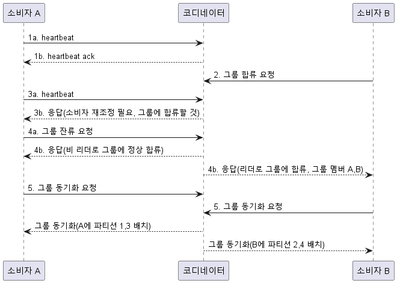
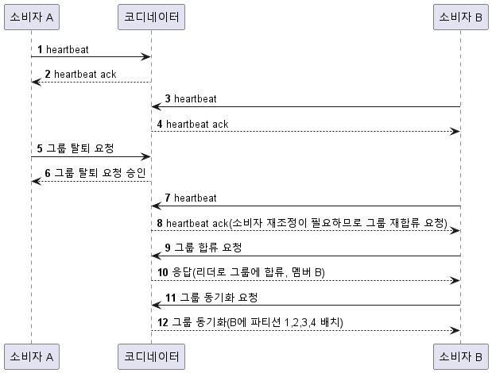
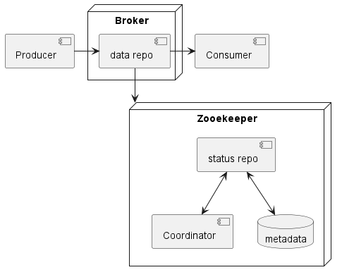

# 분산 메시지 큐
* 메시지 큐는 인터페이스 경계로 나뉜 블록 사이의 통신과 조율을 담당한다
* 메시지 큐 사용시 생기는 이점
    * 결합도 완화
    * 규모 확장성 개선
    * 가용성 개선
    * 성능 개선
* 대표적으로 kafka, rocketMQ rabbitMQ, pulsar, activeMQ, zeroMQ 등이 있다

### 메시지 큐 대 이벤트 스트리밍 플랫폼
* 메시지 큐와 이벤트 스트리밍 플랫폼 사이의 지원하는 기능이 서로 수렴하면서 경계가 희미해지고 있다
* 데이터 장기 보관과 메시지 반복 소비의 부가 기능을 갖춘 분산 메시지 큐를 설계해 보자

## 1단계: 문제 이해 및 설계 범위 확정
* 메시지의 형태와 크기 : 텍스트, nKB
* 메시지는 반복적으로 소비될 수 있음
* 메시지는 생산된 순서대로 소비됨
* 데이터의 retention 기간은 2주
* 지원해야 하는 producer와 consumer 수는 많을수록 좋다
* 전달 방식은 at least once, at most once, exactly once 모두 지원하면 좋다
* 높은 대역폭을 제공해야 함

### 기능 요구사항
* 메시지 큐에 송/수신 할 수 있다
* 반복 수신도 가능하고, 한번만 수신하도록 설정 할 수도 있다
* retention 주기를 지정할 수 있다
* 메시지는 KB 수준이다
* 생산된 순서대로 consumer에게 전달할 수 있다
* at least once, at most once, exactly once 중 지정할 수 있다

### 비기능 요구사항
* 높은 대역폭과 낮은 전송 지연중 하나를 선택할 수 있다
* 규모 확장성을 가져야 한다
* 지속성 및 내구성을 가져야 한다, replica를 만들어야 한다

### 전통적 메시지 큐와 다른 점
* 전통적 메시지 큐는 메시지의 보관에 중점을 두지 않는다, consumer에게 전달되기 충분한 기간만 메모리에 보관한다
* 처리 용량을 넘어서면 디스크에 보관하긴 하지만 크지 않다

## 2단계: 개략적 설계안 제시 및 동의 구하기
* producer -> 큐 <-> consumer
* producer는 메시지를 큐에 발행
* 큐는 producer와 consumer의 결합을 느슨하게 하는 서비스, 독립적인 운영 및 규모 확장을 가능하게 함
* producer consumer는 클라이언트/서버 관점에서 보면 클라이언트이고 서버 역할은 메시지 큐가 됨

### 메시지 모델
* 가장 널리 쓰이는 메시지 모델은 point-to-point와 pub/sub 모델이다
* point-to-point 모델
    * 전통적인 메시지 큐에서 흔히 사용하는 모델
    * 큐에서 시메지를 오직 하나의 consumer만 가져갈 수 있다
    * 어떤 consumer가 메시지를 가지고 가고 큐에 알리면 메시지는 큐에서 삭제된다
    * 데이터 보관을 지원하지 않는다
* pub/sub 모델
    * topic이라는 새로운 개념이 필요하다
    * 각 topic은 메시지 큐 전반에서 고유한 이름을 가진다
    * 메시지는 모든 consumer에게 전달된다
### topic, partition, broker
* topic에 보관되는 데이터의 양이 커져서 서버 한대로 감당할 수 없다면?
* 파티셔닝을 활용한다(샤딩)
* partition은 메시지 큐 클러스터 내의 서버에 고르게 분산 배치한다
* 각 topic의 partition은 FIFO 큐로 동작한다, 같은 partition 내의 메시지 순서를 offset을 통해 유지한다
* 각 메시지에는 id가 존재하고 id에 따라 파티셔닝 되어 이동한다, 없으면 랜덤 배치한다
* consumer는 하나 이상의 partition에서 데이터를 가지고 오고, consumer가 여럿인 경우 각 partition의 일부를 담당한다
* 이것을 consumer group이라 부른다

### consumer 그룹
* 하나의 consumer 그룹은 여러 topic을 구독할 수 있고 오프셋을 별도로 관리한다
* 같은 그룹 내의 consumer는 메시지를 병렬로 소비할 수 있다
* 순서를 보장하기 위해서는 하나의 consumer만 partition을 소비하면 된다
* partition의 크기가 consumer의 수보다 작으면 불균형이 발생하므로 partition을 미리 할당 해두는 편이 좋다

### 개략적 설계

* 클라이언트
    * producer, consumer
* 핵심 서비스 및 저장소
    * broker : partition을 유지한다
    * 저장소
        * 데이터 저장소 : 메시지를 보관한다
        * 상태 저장소 : consumer의 상태 관리
        * 메타데이터 저장소 : topic의 설정, 속성을 관리
    * 조정 서비스
        * 서비스 탐색 : broker 상태 관리
        * 리더 선출 : broker 가운데 컨트롤러를 담당할 리더를 선출한다
        * zookeeper, etcd 컨트롤러 선출을 위한 컴포넌트로 이용된다

## 3단계: 상세 설계
* 데이터를 장기보관하면서 높은 대역폭을 제공하기 위해 기술적 결정을 내리자
* 디스크 기반 자료 구조
    * rotational disk의 높은 순차 탐색 성능
    * 적극적 디스크 캐시 전략
* 메시지가 수정 없이도 전송이 가능한 메시지 자료 구조 설계
    * 데이터의 양이 큰 경우 메시지 복사에 드는 비용을 최소화하기 위함
* 일괄 처리를 우선하는 시스템
    * 소규모의 I/O가 많으면 대역폭을 높이기 어렵다
  > 이는 I/O 작업에 오버헤드가 있기 때문인데
  >
  > I/O 처리를 위한 새로운 스레드나 프로세스를 생성
  >
  > Buffering 측면에서도 큰 버퍼를 활용하기 어려움
  >
  > disk는 순차 쓰기가 유리한데 소규모의 I/O를 반복해서 발생 시키면 자연스럽게 random access가 많이 발생함

### 데이터 저장소
* 트래픽 패턴
    * 읽기/쓰기가 빈번하게 발생
    * 갱신/삭제 연산은 없음
    * sequential read/write
* 선택지 1 : 데이터 베이스
    * RDBMS : topic별 테이블 생성, 메시지별 record 추가
    * NOSQL : topic별 컬렉션 생성, 메시지별 document 추가
    * 데이터 베이스는 대규모 I/O를 처리하기에 적합한 기술은 아님
* 선택지 2 : 쓰기 우선 로그
    * append-only 일반 파일
    * Mysql의 복구 로그, 아파치 zookeeper에서도 사용
    * WAL에 대한 접근은 read/write가 모두 순차적 : 디스크의 성능에 이점
* 디스크 성능 관련 유의사항
    * 데이터의 장기 보관을 위해 비용이 저렴한 디스크 드라이브를 활용한다
    * 디스크 드라이브의 단점 인느린 속도는 random access 때문이며 순차 접근을 통해 이를 보완하고
      비용이 저렴한 디스크 드라이브를 사용하여 많은 데이터를 저장할 수 있다

### 메시지 자료 구조
* 메시지 자료 구조는 producer, 메시지 큐, consumer 사이의 계약이다
* 메시지가 큐를 거쳐 consumer에게 전달되는 과정에서 불필요한 복사를 제거하여 높은 대역폭을 달성하고자 한다
* 서로 간의 다른 자료구조를 사용하면 메시지가 변경되어야 하고 그 과정에서 값비싼 동작인 복사가 발생할 수 있다

|   필드 이름   | 데이터 자료형 |
 |:---------:|:--------|
|    key    |byte[]|
|   value   |byte[]|
|   topic   |string|
| partition |integer|
|  offset   |long|
| timestamp |long|
|   size    |integer|
|crc|integer|


* 메시지 key
    * key는 partition을 정할 때 사용된다
* 메시지 value
    * 내용, 즉 payload를 의미
* 메시지의 기타 필드
    * topic : topic 이름
    * partition : partition의 id
    * offset : partition 내 메시지의 위치
    * crc : 순환 중복 검사, 주어진 데이터의 무결성을 보장하는데 사용
### 일괄 처리
* 각 컴포넌트는 성능적 이유로 가급적 일괄 처리한다
* 여러 메시지를 한 번의 네트워크 요청으로 전송할 수 있어 왕복 비용을 줄일 수 있다
* 한 번에 여러 메시지를 기록하면 순차 쓰기 연산의 규모가 커지고 디스크의 접근 대역폭을 높일 수 있다
* 그러나 배치 처리가 커질수록 응답 지연은 높아지게 마련이므로 지연을 낮추기 위해서는 일괄 처리 양을 줄인다
* 처리량을 높이고자 한다면 topic당 partition의 수를 늘려서 어느 정도 대응할 수 있다

### producer 측 작업 흐름
* 메시지를 전송해야 할 때 producer는 어느 broker에 연결해야 하는가?
* broker가 여러 개로 복제되어있다면 리더 로브커에 보내는 것이 가장 적절할 것이다
    * producer는 메시지를 라우팅 계층으로 보내고, 라우팅 계층은 메타데이터 저장소에서 각 사본의 위치를 읽어 리더 사본으로 보낸다
    * 리더 사본의 데이터를 각 사본으로 복제되고 `충분한` 숫자가 동기화되면 데이터를 디스크에 기록하고 producer에게 회신을 보낸다
* 여기에는 몇 가지 단점이 있다
    * 라우팅 계층으로 인한 오버헤드
    * 성능을 위한 일괄 처리에 대한 고려 부족
* 라우팅 계층을 producer 내부로 편입시키고, 버퍼를 도입한다
    * 라우팅의 오버헤드 감소
    * producer의 메시지 전송 로직을 스스로 가질 수 있음
    * 전송할 메시지를 버퍼에 쌓아두었다가 일괄 전송할 수 있다
> 라우팅을 사용해도 버퍼에 쌓아두었다가 일괄 전송하면 되지 않나
* 얼마나 많은 메시지를 일괄 처리하는 것이 좋을까?
    * 이것은 결국 대역폭과 응답 지연 사이의 타협점을 찾는 문제
    * 메시지 큐의 용도를 감안하여 일괄 처리 메시지 양을 조정해야 한다

### consumer 측 작업 흐름
* consumer는 특정 partition의 오프셋에 따라 해당 위치에서부터 이벤트를 묶어 가져온다

### 푸시 vs 풀
* broker가 데이터를 consumer에게 보낼 것이냐, consumer가 broker에서 가져갈 것이냐
* 푸시
    * 장점
        * 낮은 지연 : broker가 받자마자 consumer에게 보낼 수 있다
    * 단점
        * consumer의 capa가 더 작은 경우 consumer에 큰 부하가 발생할 수 있다
        * producer가 throttling을 관리하므로 consumer가 항상 그에 맞게 자원을 준비해두어야 한다
* 풀
    * 장점
        * consumer 별로 필요한 형태와 속도로 메시지를 가지고 갈 수 있다
        * consumer가 준비된 경우 쌓여있는 데이터를 일괄 처리할 수 있다는 장점이 있다
    * 단점
        * broker에 메시지가 없어도 consumer는 계속 데이터를 끌어가려 하고, 컴퓨팅 자원이 낭비된다
        * 이 문제를 해소하기 위한 long polling 전략이 있다
* 이것을 볼 때 풀 모델이 더 적합하다, 동작 흐름을 살펴보자
    1. 그룹-1, topic A인 consumer가 있다면 그룹 이름을 해싱하여 접속할 broker를 찾는다. 이 broker를 해당 consumer 그룹의 코디네이터라고 한다.
    2. 코디네이터는 consumer 를그룹에 참여시키고 partition을 할당한다
    3. consumer는 마지막으로 소비한 오프셋 이후 메시지를 가지고 온다
    4. consumer는 메시지를 처리하고 새로운 오프셋을 broker에 보낸다
### consumer 재조정(consumer rebalancing)
* consumer가 어떤 partition을 책임지는지 다시 정하는 프로세스
* 새로운 consumer가 합류하거나, 기존 consumer가 떠나거나, 장애가 발생하거나, partition이 조정되는 경우
* 코디네이터는 consumer의 heartbeat 메시지를 살피고 각 consumer의 partition 내 오프셋 정보를 관리한다
* 정확히 어떻게 관리하는지 살펴보자
    * 각 consumer는 특정 그룹에 속한다, 그룹의 전담 코디네이터는 그룹의 이름을 해싱하여 찾을 수 있고 같은 그룹의 consumer는 같은 코디네이터에 연결된다
    * 코디네이터는 자신에게 연결된 소자비 목록을 유지한다, 목록에 변화가 있으면 해당 그룹의 새 리더를 선출한다
    * 새 리더는 새 partition 배치 계획을 만들고 코디네이터에게 전달한다, 코디 네이터는 해당 계획을 그룹 내 다른 모든 consumer에게 알린다
> consumer 그룹은 왜 리더가 필요한지? partition 배치 계획을 왜 consumer 그룹 리더가 만드는지?
* 재조정 시나리오를 살펴보자, 그룹 내 consumer 수는 2 partition은 4로 가정한다


* 새로운 consumer 추가


* consumer 탈퇴시


* consumer 비정상 중단 시

### 상태 저장소
* 저장되는 정보는 다음과 같다
    * consumer에 대한 partition의 배치 관계
    * consumer 그룹이 각 partition에서 마지막으로 가져간 메시지의 오프셋
* consumer 상태 정보 데이터의 이용 패턴
    * 읽기와 쓰기가 빈번하지만 양이 많지 않다
    * 데이터 갱신은 빈번하지만 삭제는 거의 없다
    * 읽기와 쓰기 연산은 무작위
    * 데이터의 일관성 중요

### 메타데이터 저장소
* topic 설정이나 속성 정보를 보관한다. partition 수, 메시지 보관 기간, 사본 배치 정보 등..
> kafka-topics.sh에 나오는 정보들
* 자주 변경되지 않고 양도 적지만 높은 일관성을 요구한다

### zookeeper
* zookeeper는 계층적 키/값 저장소 기능을 제공
* 메타 데이터와 상태 저장소는 zookeeper를 이용해 구현
* broker에는 메시지 데이터 저장소만 유지
* zookeeper가 broker 클러스터의 리더 선출 과정을 돕는다

  

### 복제
* 분산 시스템에서 하드웨어 장애는 흔한 일이므로 주의해야 한다
* 디스크의 영구적 손상이 발생하면 데이터가 사라지므로 전통적으로 replication을 통해 해결한다
```shell
parition 1 leader : 1 replicas : 1,2,3
parition 2 leader : 2 replicas : 2,3,4
parition 3 leader : 3 replicas : 3,4,5
parition 4 leader : 4 replicas : 4,5,1
parition 5 leader : 5 replicas : 5,1,2
```
* partition 1의 리더는 1, 본인을 포함한 복제본은 3개로 2,3 에 분산되어 있다 
* partition 2의 리더는 2, 본인을 포함한 복제본은 3개로 3,4 에 분산되어 있다
* 만약 partition 2의 leader인 2가 out 된다면 3,4 중 하나를 leader로 선출하고 1,5 중 하나로 replication을 시작한다

### 사본 동기화
* 노드의 장애로 메시지가 소실되는 것을 막기 위해 여러 partition으로 나누고 각 partition을 다시 사본으로 복제한다
* 메시지는 리더가 받고 다른 사본은 리더에서 메시지를 동기화 받는다
> 그래서 총 network traffic in/out은 input * 5가 된다
> 
> 예를 들어 5대의 노드에 총 10의 traffic이 들어오면
> 
> 각 2씩 traffic을 받고 자신의 replica들에 4의 트래픽을 복제한다
> 
> 각 노드의 traffic은 in 2 out 4가 되고 자신도 다른 노드로부터 4의 복제본을 받게 되므로 
> 
> in 6, out 4가 되고 5대의 노드는 50의 traffic을 처리할 수 있어야 한다
> 
> 그래서 용량 산정시 10의 트래픽이 필요하다면 cluster 내부의 총 network traffic 량은
> 
> replication 3 기준 한대당 최소 50이 필요하게 된다(5 cluster 3 replica)
> 
> 이를 통해 한대의 node가 out될 경우 증가하는 traffic을 산정할 수 있으며
> 
> replication 3의 의미인 2대까지의 out을 허용 하겠다면 network도 여기에 맞춰서 여유분을 두어야 한다
> 
> (consumer에 의해 증가하는 traffic은 예외로 둔다)

* ISR은 현재 동기화된 replica를 의미하며 값의 설정에 따라 동기화 되어있는지 여부를 확인한다
  * 예를 들어 ISR에서 허용하는 message의 diff가 4라면 현재 leader와 메시지 개수가 3개 차이난다면 ISR 상태에 있다고 할 수 있다
* ISR 상태에 가지 못한 replica들은 ISR 상태로 전환될때까지 leader의 메시지를 복제 받아야 한다
* ISR은 성능과 영속성 사이의 타협점이다
  * 모든 노드가 ISR이 될때까지 읽어갈 수 없다면 데이터가 깨진 경우 오랜시간 message queue를 사용할 수 없을 것이므로
  * 일정 비율의 ISR이 되었을때 메시지를 정상 처리하였다는 응답을 주고 계속해서 replica를 sync한다

* ACK=all
  * 모든 broker가 ISR 상태가 되었을때 ack를 준다, 느린 ISR의 응답을 기다리므로 성능은 떨어지고 영속성이 높아진다
* ACK=1
  * 리더가 메시지를 저장하면 바로 ACK를 주므로 빠른 응답시간을 보장한다
  * 데이터가 동기화되지 않았으므로 leader 장애시 즉시 유실이 발생한다
* ACK=0
  * 저장을 기다리지 않고 즉시 응답하는 설정
  * 메시지의 유실이 서비스에 영향이 없는 경우 사용하는 설정
* 리더에서만 메시지를 읽어가도록 하는 이유가 무엇일까?
  * 설계가 단순하기 때문
  * 특정 partition에 데이터가 몰리지 않도록 분산되어 있기 때문에 여기에 대한 문제를 거의 발생할 가능성이 없다

### 규모 확장성
* 주요 시스템 컴포넌트의 규모 확장성을 알아보자
### producer
* 단순히 producer를 추가하면 된다
### consumer
* 그룹이 다른 경우 별개이므로 관계 없음
* 그룹 내에 추가되는 경우 rebalancing이 발생한다
> kafka의 경우 rebalancing 비용이 매우 비싸기 때문에 consumer를 뗐다 붙였다 하는 동작은 바람직하지 않고 제대로 동작하지도 않는다
### broker
```shell
parition 1 leader : 1 replicas : 1,2,3  ISR : 1,2,3
parition 2 leader : 2 replicas : 2,3,4  ISR : 2,3,4
parition 3 leader : 3 replicas : 3,4,5  ISR : 3,4,5
parition 4 leader : 4 replicas : 4,5,1  ISR : 4,5,1
parition 5 leader : 5 replicas : 5,1,2  ISR : 5,1,2
```
* 먼저 broker의 장애 복구 전략을 알아보자
* 위와 같은 경우 broker 3에 장애가 발생한다고 가정해보자
```shell
parition 1 leader : 1 replicas : 1,2,3  ISR : 1,2
parition 2 leader : 2 replicas : 2,3,4  ISR : 2,4
parition 3 leader : 4 replicas : 3,4,5  ISR : 4,5
parition 4 leader : 4 replicas : 4,5,1  ISR : 4,5,1
parition 5 leader : 5 replicas : 5,1,2  ISR : 5,1,2
```
* 먼저 broker 3이 leader인 partition의 leader가 새로 선출되고 각 ISR에서 3이 제거된다
* 일정 시간 이상 3이 복구되지 않으면 replica가 변경된다
```shell
parition 1 leader : 1 replicas : 1,2,4  ISR : 1,2
parition 2 leader : 2 replicas : 2,5,4  ISR : 2,4
parition 3 leader : 4 replicas : 1,4,5  ISR : 4,5
parition 4 leader : 4 replicas : 4,5,1  ISR : 4,5,1
parition 5 leader : 5 replicas : 5,1,2  ISR : 5,1,2
```
* replica가 변경되어도 ISR 상태가 되지 못했기 때문에 복제하면서 계속해서 서비스를 진행한다
```shell
parition 1 leader : 1 replicas : 1,2,4  ISR : 1,2,4
parition 2 leader : 2 replicas : 2,5,4  ISR : 2,4,5
parition 3 leader : 4 replicas : 1,4,5  ISR : 4,5,1
parition 4 leader : 4 replicas : 4,5,1  ISR : 4,5,1
parition 5 leader : 5 replicas : 5,1,2  ISR : 5,1,2
```
* 최종적으로 모든 partition이 ISR 상태에 들어가게 된다
* broker의 결함 내성을 높이기 위한 고려사항들
  * ACK는 몇으로 둘 것인가?
  * replica는 같은 노드에 두어선 안된다
  * partition의 사본을 가진 모든 노드에 장애가 발생할 경우 데이터는 소실된다, 어떻게 분산할 것인가
    * 다른 region 또는 데이터 센터에 분산하는 것이 안전하지만 동기화로 인한 지연과 비용이 증가하는 문제가 있다
  
### partition
* partition의 추가는 producer/consumer 안정성에는 영향을 끼치지 않는다  
* partition이 추가되는 경우
  * 추가된 이후부터 발생한 데이터들만 신규 partition으로 보관되기 시작한다
  * 기존 데이터는 이동되지 않는다
* partition이 삭제되는 경우
  * 새로운 데이터는 다른 partition에만 보관된다
  * 삭제된 partition의 데이터는 즉시 제거되지 않고 일정 시간 유지된다
  * 유지 기간이 지나면 데이터를 삭제하고 저장 공간을 반환한다
  * 실제로 partition이 제거되면 producer 그룹은 rebalncing이 필요하다

### 메시지 전달 방식
* 최대 한 번(at-most once) : 소실되더라도 재전송 하지 않는다
  * producer는 ACK=0 
  * consumer는 메시지를 읽고 처리하기 전에 오프셋을 갱신한다, 갱신 직후 장애가 발생해도 메시지는 다시 소비되지 않는다  
  * 메트릭과 같은 소실 감수할 수 있는 데이터에 사용
* 최소 한 번(at-least once) : 중복 발생할 수 있으나 메시지 소실은 발생하지 않는다
  * producer는 ACK=1 / ACK=all, 응답이 없으면 반복 재시도 한다
  * consumer는 데이터를 처리하고 나서 오프셋을 갱신한다
  * 메시지 처리가 실패한 경우 메시지를 다시 가져오므로 소실되지 않는다
    * 처리하고 오프셋 갱신 실패후 장애 발생한다면 중복처리될 수 있다
  * 데이터 중복을 감내할 수 있는 어플리케이션인 경우 사용
* 정확히 한 번(exactly once) : ?

### 고급 기능
* 메시지 필터링
  * 특정 유형의 메시지에만 관심 있는 경우
  * topic을 분리하면 되지만 그때마다 새로 만들 것인가?
  * 같은 메시지를 여러 topic에 중복 저장하는 것은 자원 낭비가 된다
  * producer와 consumer의 커플링이 높아진다
  * 가장 쉬운 구현 방법은 메시지를 받고 필요없는 메시지를 버리는 방법이 있다
    * 불필요한 트래픽이 발생한다
  * broker에서 메시지를 필터링하여 consumer가 원하는 메시지만 받도록 한다
    * payload를 읽을 경우 broker의 성능 저하가 발생한다
    * 따라서 가급적 메시지의 payload 보다는 메터데이터 영역에서 추출한다
    * 예를 들면 각 메시지에 tag를 두는 방안을 생각해 볼 수 있다
* 메시지의 지연 전송 및 예약 전송
  * 예를 들어 주문 후 30분 안에 결재가 되지 않는다면 주문이 자동 취소되게 하고자 한다면
  * 30분 지연 후에 consumer에게 전달하면 consumer가 메시지를 받았을때 결재 여부를 확인하고 취소한다
  * 임시 저장소에 넣어 두었다가 시간이 지나면 전송하고자 하는 topic으로 옮기는 방법이 있을 수 있다
> 임시 저장소의 저장 가능한 크기를 초과하는 경우에 대한 복잡성 해소가 어려울 듯하다
>
> 꼭 큐에서 지원할 필요는 없지 않을까?

## 4단계: 마무리
* DLQ나 이력 데이터 archive에 대해서 얘기해보는 것도 좋겠다
  * DLQ : 실패한 메시지를 반복 재시도하지 않도록 하기 위해 실패를 재시도 전용 topic으로 분리한다
  * 이력 데이터 아카이브 : 이미 처리된 메시지의 경우 재시도 하고자 한다면
    * 이력을 cold stroage로 전송하고 필요할 때 다시 꺼내서 처리하도록 하면 어떨까?