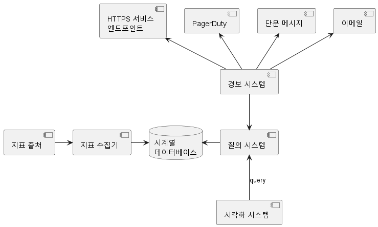
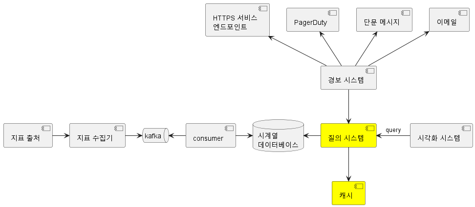

# 지표 모니터링 및 경보 시스템
* 잘 설계된 지표 모니터링 및 경보 시스템은 인프라의 상태를 선명하게 볼 수 있도록 하여 높은 가용성과 안정성을 달성하는 데 중추적 역할을 한다
* 대표적으로
  * datadog, influxdb, nagios, prometheus, grafana, graphite등이 있다
## 1단계: 문제 이해 및 설계 범위 확정
* 설계 범위 확정에 도움이 될 만한 질문을 통해 설계 범위를 확정해보자
* 질문 : 시스템의 고객은 누구인가요? 대형 IT 업체의 회사 내부용 시스템인가요? 아니면 Datadog이나 Splunk와 같은 SaaS 제품인가요?
  * 답변 : 회사 내부용 시스템이라고 가정하겠습니다
* 질문 : 어떤 지표를 수집해야 하나요?
  * 답변 : 시스템 운영 지표를 수집해야 합니다. CPU부하, 메모리 사용률, disk 사용량 같은 저수준의 운영체제 사용률 지표일 수도 있고,
  서버가 처리하는 초당 요청 수나 웹 서버 프로세스 개수 같은 고차원적 개념에 관계된 지표일 수도 있습니다. 하지만 사업 지표는 시스템이 처리해야할 지표가 아닙니다
* 질문 : 모니터링할 인프라 규모는 어느 정도인가요?
  * 답변 : 일간 능동 사용자 수는 1억명이고, 1000개의 서버 풀이 있고 풀마다 100개의 서버 하드웨어를 유지하고 있습니다
* 질문 : 지표 데이터는 얼마나 오래 유지해야 하나요?
  * 답변 : 1년 동안은 보관해야 합니다
* 질문 : 장기 보관으로 옮길때 지표의 해상도를 낮추어도 되나요?
  * 답변 : 좋은 질문입니다, 새로 수집한 데이터는 7일 동안 보관하고, 7일뒤에는 1분 단위로 30일간 보관하고 그 뒤에는 1시간 단위로 변환해서 보관하는 것으로 하겠습니다
* 질문 : 경보 채널로 필요한 것들은 어떤것이 있나요?
  * 답변 : 이메일, 전화, 페이저듀티, 웹훅 등을 지원하는 것으로 하겠습니다
* 질문 : 에러나 액세스에 대한 로그 수집도 가능해야 하나요?
  * 답변 : 제외합니다
* 질문 : 분산 시스템 추적도 가능해야 하나요?
  * 답변 : 필요 없습니다

> 예상되는 도메인
> 
> 수집, 저장, 뷰어, 경고

### 개략적 요구사항 및 가정
* 대규모 인프라를 모니터링 해야 함
  * 일간 능동 사용자 1억명
  * 서버 풀 1000개 풀당 서버 100개, 서버당 100개의 운영 지표
    * 지표의 수는 대략 1000 * 100 * 100으로 천만개
  * 데이터 보관 기간은 1년
  * raw는 일주일 그 뒤는 1분으로 30일간, 그 두는 1시간 단위로 1년간
* 모니터링할 지표 예시
  * cpu 사용률
  * 요청 수
  * 메모리 사용량
  * 메시지 큐 내의 메시지 수

### 비기능 요구사항
* 규모 확장성 : 시스템은 늘어나는 지표 수와 경보의 양에 맞게 확장될 수 있어야 한다
* 낮은 응답 지연 : 대시보드와 경보를 신속하게 처리할 수 있게 질의에 대한 낮은 응답 지연을 보장해야 한다
* 안정성 : 높은 안정성을 제공하여 중요 정보를 놓치지 않도록 해야 한다
* 유연성 : 유연하게 변경 가능한 파이프라인을 이용해 구축한 시스템이어야 한다
* 아래는 고려하지 않아도 된다
  * 로그 모니터링
  * 분산 시스템 추적

## 2단계: 개략적 설계안 제시 및 동의 구하기 
### 기본적 사항
* 일반적으로 필요한 컴포넌트(도메인)을 예상해본다
* 데이터 수집 : 지표 데이터를 수집한다
* 데이터 전송 : 지표 데이터를 모니터링 시스템으로 전송한다
* 데이터 저장소 : 전송되어 오는 데이터를 정리하고 저장한다
* 경보 : 데이터를 분석하고 이상 징후를 감지하고 경보를 발생 시킨다, 다양한 채널로 경보를 발송할 수 있어야 한다
* 시각화 : 데이터를 차트나 그래프 등으로 제공한다

### 데이터 모델
* 지표는 통상 시계열 데이터 형태로 기록한다

* 예시 1 : cpu load에 대한 데이터와 레이블

| metric_name |      cpu.load       |
|:-----------:|:-------------------:|
|   labels    | host:i631, env:prod |
|timestamp|161423121|
|value|0.29|

* 예시 2 : 지난 10분의 cpu load 평균값을 얻기 위해서는 어떻게 해야 할까?
```shell
CPU.load host=webserver01,region=us-west 1613707265 50
CPU.load host=webserver01,region=us-west 1613707265 62
CPU.load host=webserver02,region=us-west 1613707265 43
CPU.load host=webserver02,region=us-west 1613707265 53
...
CPU.load host=webserver01,region=us-west 1613707265 76
CPU.load host=webserver01,region=us-west 1613707265 83
```
* 각 행의 마지막에 기록된 cpu 부하 수치의 평균을 구하면 된다
  * 50+62+43+...83 / n

|         이름         |        자료형        |
|:------------------:|:-----------------:|
|       지표 이름        |        문자열        |
|     태그/레이블 집합      |   <키:값> 쌍의 리스트    |
| 지표 값 및 그 타임스탬프의 배열 | <값, 타임스탬프> 쌍의 배열> |

* 데이터 접근 패턴
  * 쓰기 부하는 시간의 흐름에 따라 일정하게 매우 많이 발생한다
  * 대부분의 I/O는 쓰기로 발생한다
  * 반면 읽기는 스파이크 패턴을 보인다
    * 일시적으로 증가했다가 요청이 없어질 수 있다

* 데이터 저장소 시스템
  * 시스템을 직접 설계하거나 MySQL과 같은 범용 저장소 시스템을 사용하는 것 모두 추천하지 않는다
    * 시계열 데이터를 대상으로 하는 연산에 최적화되어 있지 않기 때문
    * 이미 influxDB와 Prometheus라는 훌륭한 솔루션이 시장에 존재함

### 개략적 설계안


* metrics source : 지표가 생성되는 곳
* metrics collector : 지표 데이터를 수집하고 시계열 데이터에 기록
* time-series database : 지표 데이터를 시계열 데이터 형태로 보관, query interface 제공
* query service : 질의를 가져오는 과정을 돕는다, 좋은 db가 있다면 일이 줄어들거나 없어도 된다
* alerting system : 경보를 받아야 하는 다양한 대상으로 경보 알림을 전송한다
* visualization system : 지표를 다양한 형태의 그래프/차트로 시각화 하는 기능을 제공하는 시스템

## 3단계: 상세 설계
* 각 컴포넌트의 처리 흐름을 알아보자

### 지표 수집
* Counter나 CPU 사용량과 같은 지표는 데이터의 정확도가 큰 영향을 끼치지는 않는다
* pull vs push model
  * pull
    * collector가 중심인 모델
    * collector 내부에 모든 지표를 가져와야 하는 대상을 저장해두면 되지만 수시로 변경되는 대규모 운영환경에서는 적용이 어렵다
    * etcd나 zookeeper와 같은 서비스 탐색 기술을 활용하여 이 문제를 해결한다
      * 각 서비스는 자신의 가용성 정보를 서비스 탐색 서비스에 기록하고 목록에 변경이 생기면 지표 수집기에 통보한다
      * 문제점
        * 지표 수집기가 여러대인 경우 중복 지표를 가지고 올 우려가 있음
        * 이를 해결하기 위해 안정 해시 링과 같은 방식을 사용하여 각 담당할 서버를 분배하는 방법이 있다
  * push
    * 지표를 생산하는 모듈이 직접 전송하는 모델
    * 일반적으로 에이전트를 모듈에 설치하여 전송하는 방식이 된다
    * 집계등을 사전 처리할 수 있는 장점도 있다

| 항목  | pull | push |         description          |
|:--:|:----:|:--:|:----------------------------:|
| 디버깅 |  v   |      |      endpoint에 바로 접근 가능      |
|상태 진단 |  v   |      |         장애 지점 파악이 쉽다         |
| 프로세스 shutdown|      | v| 지표를 가져가기 전에 프로세스가 종료될 위험이 적다 |
|네트워크 구성 |      | v|     상대적으로 인프라 구성이 덜 복잡하다     |
|성능|      | v    |tcp/udp 를 각각 사용하는데 udp가 전송지연이 더 낮기 때문|
|데이터 정확도|  -   | -    |허가된 요청 / 모든 요청인데, 이는 인증을 강제하여 해결할 수 있다|

### 지표 전송 파이프라인의 규모 확장
* 수집기는 서버 클러스터 형태이며 엄청난 양의 데이터를 받아 처리해야 한다
* time-series db에 장애가 생기면 데이터 손실이 발생할 가능성이 있으므로 앞에 큐를 하나 두는 방법이 있다


* 수집기와 처리 사이의 결합도를 낮추고, db 장애의 영향을 낮출 수 있다

### 데이터 집계 지점
* 수집 에이전트
  * 복잡한 집계 로직은 지원하기 어렵다.
  * 자신이 가지고 있는 데이터만 볼 수 있으므로, 합산 정도는 가능
* 데이터 수집 파이프 라인
  * 기록되는 양을 줄일 수 있는 장점이 있으나 
  * 원본 데이터가 없어지는 문제
  * 늦게 온 데이터의 집계 문제
* 질의 시에 집계하는 방안
  * 속도가 느린 문제

### 질의 서비스
* visualizer 또는 alert system과 time-series db 사이의 결합도를 낮출 수 있다
* 캐시 계층
  * 질의 결과를 캐싱하면 db의 부하를 낮추고 질의 서비스의 성능을 높일 수 있다



### 저장소 계층
* time-series db에 query중 85%는 지난 26시간 내에 수집된 데이터가 대상이 된다
* 데이터 인코딩 및 압축
  * 데이터의 최초값과 이후로는 델타만 저장하는 방식이 있다
  * 32비트를 10번 저장하는것 보다 32비트를 1번, 4비트를 9번 저장한다면 28*9 만큼의 비트를 아낄 수 있다
  * 
### 경보 시스템
### 시각화 시스템
