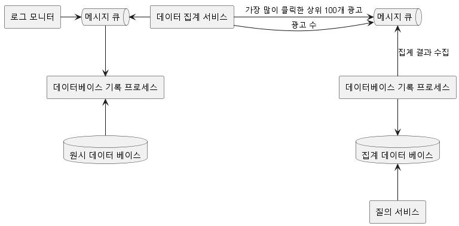
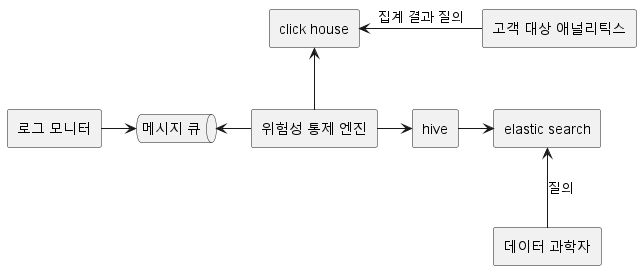

# 광고 클릭 이벤트 집계(ad click event aggregation system)
* 페이스북이나 구글 규모에 맞는 광고 클릭 이벤트 집계 시스템을 설계해보자
* 디지털 광고의 핵심 프로세스는 RTB(Real Time Bidding)이다
* RTB를 통해 광고가 나갈 지면(inventory)을 거래한다


## 1단계: 문제 이해 및 설계 범위 확정
* Q : 데이터의 입력은 어떤 형태로 이루어 지나요?
  * A : 여러 서버에 분산된 로그 파일로 존재합니다
* Q : 데이터의 양은 어느 정도 인가요?
  * A : 매일 10억 클릭이 발생하고 광고는 200만 회 게재됩니다. 수는 매년 30% 증가합니다
* Q : 어떤 질의를 지원해야 하나요?
  * A : 특정 광고에 대한 지난 M분간의 클릭 이벤트 수, 질의 기간과 광고 수가 변경 가능한 지난 1분간 가장 많이 클릭된 광고 100개, ip, user_id, country를 기준으로 상기 2개 질의 결과를 필터링 할 수 있어야 한다
* Q : 늦게 도착하는 이벤트나, 중복 이벤트, 시스템 복구에 대한 고려가 필요 할까요?
  * A : 필요합니다
* Q : 지연 시간 요건은 어떻습니까?
  * A : 모든 처리는 수 분 내에 이루어져야 합니다. RTB와 광고 클릭 집계의 요구는 분리해야 합니다

### 기능 요구사항
* 지난 M분 동안의 ad_id 클릭 수 집계
* 매분 가장 많이 클릭된 상위 100개 광고 아이디를 반환
* 다양한 속성에 따른 집계 필터링 지원
* 데이터의 양은 페이스북, 구글 규모

### 비기능 요구사항
* 집계 결과 정확성은 데이터가 RTB 및 광고 과금에 사용되므로 중요하다
* 지연되거나 중복된 이벤트를 적절히 처리할 수 있다
* reliability : 부분적인 장애는 감내할 수 있어야 함
* 지연 시간 요구사항: 전체 처리 시간은 최대 수 분을 넘지 않아야 함

### 개략적 추정
* DAU는 10억 명
* 사용자는 하루 평균 1개 광고를 클릭
* QPS = 10억 / 86400초(100000) = 10,000
* 최대 QPS는 다섯 배인 50,000으로 가정
* 클릭 이벤트 하나를 0.1KB 라고 하면 일 100GB, 월 3TB

## 2단계: 개략적 설계안 제시 및 동의 구하기 
### 질의 API 설계
* consumer app의 클라이언트는 일반적으로 제품의 최종 사용자이지만
* 이 경우는 dashboard를 사용하는 data scientist, product manager, 광고주가 된다
* 기능 요구 사항은 아래와 가타
  * 지난 M분 동안의 ad_id 클릭 수 집계
  * 매분 가장 많이 클릭된 상위 100개 광고 아이디를 반환
  * 다양한 속성에 따른 집계 필터링 지원

**API 1 : 지난 M분간 각 ad_id에 발생한 클릭 수 집계**

```
GET /v1/ads/{:ad_id}/aggregated_count
```
**params**
```

from : 집계 시작
to : 집계 종료
filter : 필터링 전략
```
**response**
```json
{
  "ad_id" : "ad_id",
  "count" : 123
}
```


**API 2 : 지난 M분간 각 ad_id에 발생한 클릭 수 집계**

```
GET /v1/ads/popular_ads
```
**params**
```
count : 상위 몇 개의 광고를 반환할 지
window : 분 단위로 표현된 집계 윈도 크기
filter : 필터링 전략
```
**response**
```json
{
  "ad_ids" : ["id1", "id2", "id3"]
}
```

### 데이터 모델
* 시스템의 데이터는 raw 데이터와 aggregated 데이터가 있다

| |               raw data                |    aggregated data     |
|:--:|:-------------------------------------:|:----------------------:|
|장점| 원본 데이터를 손실 없이 보관<br/>데이터 필터링 및 재계산 지원 | 데이터 용량 절감<br/>빠른 질의 성능 |
|단점|        막대한 데이터 용량<br/>낮은 질의 성능        |         데이터 손실         |

* 둘 다 저장을 해두자
* 문제 발생 시 디버깅이 필요하다
* raw data는 크기의 문제로 쿼리용으로 사용하긴 어렵다

### 올바른 데이터베이스의 선택
* 데이터의 형태를 살펴보면
* raw data의 경우 대부분은 쓰기 작업이다
  * 따라서 쓰기에 유리한 카산드라 또는 influxDB를 사용하는 것이 바람직 하다
  * S3와 같은 blob storage에 ORC, Parquet, AVRO와 같은 데이터 형식으로 저장하는 방법도 있다
* aggregated data의 경우 쓰기와 읽기가 모두 많이 발생한다

### 개략적 설계안


**비동기 처리**
* 개략적 설계안은 동기식으로 처리한다
  * 예기치 못한 트래픽의 증가는 전체 시스템의 장애로 이어진다
  * 카프카와 같은 메시지 큐를 도입하여 생산자와 소비자의 결합을 끊는 방법이 있다



* 두 번째 메시지 큐의 데이터 유형은 아래와 같다
  1. 분 단위로 집계된 광고 클릭 수 : ad_id, click_minute, count
  2. 분 단위로 집계한, 가장 많이 클릭한 상위 N개 광고 : update_time_minute, most_clicked_ads
> 원자적 커밋을 위해 카프카 같은 시스템을 두 번째 메시지 큐로 도입하는 이유?
> 
> 오히려 db를 이용하는 것이 exactly once에 더 가까운 것 아닌가?

### 집계 서비스
* 광고 클릭 이벤트를 집계하는 좋은 방안 하나는 맵리듀스 프레임워크를 사용하는 것이다
> 맵 리듀스는 hadoop 위에서 수행되는 프레임워크
> 
> java로 프로그램을 개발하고 배포해야 하는 복잡성을 해소하기 위해 
> 
> 단순한 연산들은 on demand로 처리할 수 있는 hive로 대체됨
> 
> map/reduce, hive의 disk operation으로 인한 속도 저하를 해결하기 위해
> 
> presto, spark와 같은 in memory 기반의 쿼리 시스템이 대두되었다
>
> 각자 처리할 수 있는 데이터의 유형은 약간씩 다를 수 있다

**주요 사용 사례**
* 지난 M분간 ad_id에 발생한 클릭 이벤트 수 집계
* 지난 M분간 가장 많은 클릭이 발생한 상위 N개의 ad_id 집계
* 데이터 필터링

사례 1: 클릭 이벤트 수 집계
* map node에서 ad_id % 3 으로 이벤트를 분배하고 reduce node에서 집계하면 된다

사례 2 : 가장 많이 클릭된 N개 ad_id
* map node에서 reduce node로 보내어 집계하고, 집계된 데이터를 다시 reduce 하여 상위 N개를 뽑아낸다

사례 3 : 데이터 필터링
* 데이터를 필터링 할 수 있는 차원을 하나 추가한다(country)

| ad_id |click_minute| country | count |
|:-----:|:--:|:-------:|:-----:|
| ad001 |2024010101001|   USA   |  100  |
| ad001 |2024010101001|   GPB   | 1200  |
| ad001 |2024010101001| others  | 1100  |
| ad002 |2024010101001|   USA   |  100  |


* 이러한 방식을 스타 스키마 라고 부른다
* 이해가 쉽고 구축이 편리
* 정규화가 없으므로 중복된 데이터가 많이 발생한다

## 3단계: 상세 설계
### 스트리밍 vs 일괄 처리
* 스트리밍과 배치를 동시에 처리할 수 있는 아키텍처를 lambda 아키텍처라고 부른다
  * 유지 관리해야 할 코드가 두벌 이라는 단점이 있다
* kappa 아키텍처는 일괄 처리와 스트리밍 처리 경로를 하나로 결합하여 이 문제를 해결한다
> kappa + 배치 처리 = lambda

### 데이터 재계산
* 집계 서비스에 중대한 버그가 있었다면 historical data replay가 필요하다


### 시간
* 집계에는 타임스탬프가 필요하다
  * 이벤트 시각 : 광고 클릭이 발생한 시각
  * 처리 시각 : 집계 서버가 이벤트를 처리한 시스템 시각
* 네트워크 지연이나 비동기적 처리 환경으로 인해 이벤트 시각과 처리 시각의 격차가 있을 수 있다
* 어느 시점을 이용하는지에 따른 차이는 아래와 같다

||장점|단점|
|:--:|:--:|:--:|
|이벤트 발생 시각|집계 결과가 정확하다| 클라이언트의 시간에 의존하므로 <br/>클라이언트의 시각이 잘못 된 경우나 악성 사용자의 조작 문제|
|처리 시각|사용자나 클라이언트의 조작이 불가|집계 결과의 정확도가 떨어진다|

* 정확도를 우선시하기로 한다
* 시스템에 늦게 도착한 이벤트를 올바르게 처리하기 위한 watermark를 일반적으로 사용한다
  * time window에 버퍼를 추가하여 정확도를 높이는 방법
  * 시간을 늘릴수록 정확도는 높아지지만 응답은 지연된다

> 예를들어 최신 결과는 10분 이전 데이터만 조회 가능한 형태로 구성할 수 있음


### 집계 윈도
* window의 종류에는 tumbling, fixed, hopping, sliding이 있다
  * **Tumbling Window** : 연속되지 않는 고정 크기의 시간 간격으로 데이터 스트림을 분할
  * Fixed Window : 고정된 시간 간격으로 데이터를 분할하지만, 시작 시간이 사용자에 의해 정의될 수 있음
  * Hopping Window : Tumbling Window와 비슷하지만, 윈도우들이 서로 겹칠 수 있음
  * **Sliding Window** : 새로운 이벤트가 발생할 때마다 윈도우가 slide되어 이벤트를 포함<br>
  예를 들어, 5분 길이의 Sliding Window는 항상 최근 5분 동안의 데이터를 포함하게 된다

### 전달 보장
* 과금에 활용될 수 있기 때문에 데이터의 정확성과 무결성이 중요하다
  * 이벤트의 중복 처리를 회피하는 방법?
  * 모든 에빈트의 처리를 보장하는 방법?
* 중복 제거
  * 클라이언트가 악의적인 의도로 중복 이벤트를 보내는 경우
    * ad fraud, risk control 컴포넌트를 이용하여 제어한다
  * 서버 장애로 인한 중복 이벤트
  * 
  * 재 수행할 경우 오프셋 100부터 110까지를 다시 수행하게 된다
  * 
  * 문제를 해결하기 위한 분산 트랜잭션 추가
> 분산 트랜잭션을 처리하는 방법들
> 
> 2PC : 2phase commit, 준비와 커밋/롤백으로 나누고 모두 준비되면 커밋을 수행 아니라면 롤백을 수행
> 
> 3PC : 3phase commit, 네트워크 파티션과 같은 일부 실패를 위한 사전 준비를 2PC에 추가 도입
> 
> Sagas : 트랜잭션을 여러개로 나눈 후 절차대로 수행하며 중간에 실패할 경우 역연산으로 롤백 처리
> 
> distributed logs : kafka에 서 사용하는 방법으로 데이터 레코드의 시퀀스인 로그를 활용하여 트랜잭션을 처리

### 시스템 규모 확장
* 사업이 매년 30% 성장하면 트래픽이 3년마다 두 배가 된다
* 메시지 큐와 producer consumer의 규모 확장은 그냥 하면 된다

**집계 서비스의 규모 확장**
* 집계 서비스의 처리 대역폭을 높이려면?
  * ad_id를 샤딩하는 방법
  * YARN과 같은 자원 공급자에 배포하는 방법
  * 샤딩이 구현이 쉽지만 더 큰 확장을 위해 YARN과 같은 방법을 더 많이 쓴다
> consumer group으로 묶어서 집계 서비스를 그냥 늘리면 되지 않나..?

**데이터베이스의 규모 확장**
* 카산드라는 기본적으로 수평 확장을 지원한다

### 핫스팟 문제
* 광고를 집행하는 회사별 규모에 따라 핫스팟 문제가 발생할 수 있다
* 더 많은 집계 노드를 할당하여 해결하는 방안을 보자
  * 
  1. 집계(limit 100) 서비스에 너무 많은 데이터(300)가 도착하여 자원 관리자에 추가 자원을 요청한다
  2. 자원 관리자는 추가 자원을 할당한다(2개)
  3. 이벤트를 세개 그룹으로 분리하여 처리한다
  4. reducer로 전달한다

### 결함 내성
* 집계는 메모리에서 이루어지므로 집계 노드에 장애가 생기면 집계 결과도 손실된다
  * > hadoop mapreduce는 결과를 file로 중간 저장하고, 실패에 대한 fault tolerance가 기본 제공되는 것으로 알고 있음
* 스냅샷을 이용해 이전 지점에서 복구하는 것이 좋다

### 데이터 모니터링 및 정확성
* RTB 및 청구서 발행으로 사용될 수 있으므로 정확성을 보장하는 것이 중요하다

**지속적 모니터링**
* 지연 시간 : 단계마다 발생하는 지연시간을 관리할 수 있도록 모니터링이 필요하다
* 메시지 큐 크기 : 큐의 크기가 갑자기 늘어나면 집계 서비스 노드를 추가해야 할 수 있다
* 집계 노드의 시스템 자원 : system metric

**조정**
* 데이터의 무결성을 보장하기 위한 장치가 필요하다
* 각 파티션에 기록된 이벤트를 발생 시각에 따라 정렬한 결과를 실시간 결과와 비교해보는 방법
  * 진화적 아키텍처에서 언급한 아키텍처의 상태를 관리 되는지를 알 수 있는 장치가 될 수 있을듯


### 대안적 설계안


* 다른 한가지 설계안