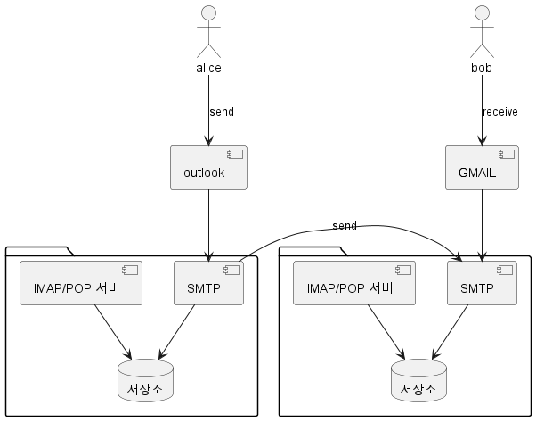
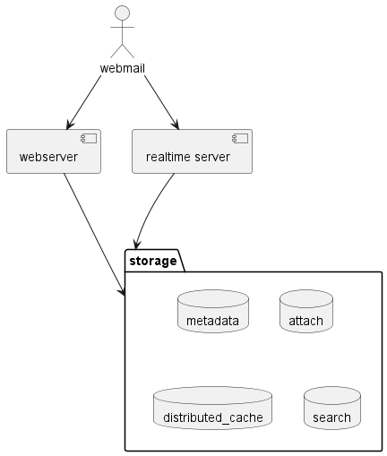

# 분산 이메일 서비스
> Gmail, Outlook, Yahoo! Mail과 같은 대규모 이메일 서비스를 설계해보자

## 1단계: 문제 이해 및 설계 범위 확정
> Q: 얼마나 많은 사람들이 사용하나요?
> 
> A: 10억 명 입니다.

> Q: 다음 기능이 필요할 것 같다.
> * 인증
> * 이메일 수/발신
> * 모든 이메일 가져오기
> * 읽음 여부에 따른 이메일 필터링
> * 제목, 발신인, 메일내용에 따른 검색
> * 스팸 및 바이러스 방지
>
> A: 인증을 제외한 이메일의 순수한 기능만을 설계하자

> Q: 메일 서버에 사용할 수 있는 프로토콜의 목록은?
>
> A: SMTP, POP, IMAP 과 서비스 제공자 전용 프로토콜을 사용할 수 있어야 한다. 지금은 HTTP로 가정하자

> Q: 첨부 파일도 지원 가능한가?
>
> A: 그렇다.

### 비기능 요구사항
* 안정성(Integrity) : 이메일 데이터는 유실되어선 안된다.
* 가용성(Availability, Fault tolerance)
* 확장성(Extensibility)
* 수정 용이성(Modifiability)

> ISO/IEC 25010에서 정의한 품질속성

### 개략적인 규모 추정
* 10억명의 사용자가 하루 평균 10개의 메일을 전송한다고 가정한다면, 100,000 QPS이다.
* 하루 평균 40건의 이메일을 수신하고, 평균 50KB로 가정한다.
* Database에 저장한다고 가정하면 1년간 유지하기 위해 10억 * 40 * 365 * 50KB = 730 PB
* 첨부파일은 20%의 이메일에 포함되며 평균 500KB로 가정한다.
* 이에 따라 연간 이메일 저장 용량은 1460PB

* 데이터의 크기는 일반적인 database에 저장하기 어렵다는 사실이 드러난다.

## 2단계: 개략적 설계안 제시 및 동의 구하기
### 이메일 101
* 이메일은 대부분 POP, IMAP, SMTP 같은 프로토콜을 사용해 왔다.
* SMTP : Simple Mail transfer Protocol, 전송용 표준 프로토콜
* POP : 수신용 표준 Protocol, 이메일을 일부만 읽을 수 없으며 읽으면 서버에서 삭제된다.
* IMAP : 수신용 표준 Protocol, 헤더만 다운로드 받고 서버에서 삭제되지 않는다. 여러개의 디바이스에서 이메일을 읽을 수 있다.

### DNS
* 수신자 도메인의 메일 교환기 레코드(Mail Exchange) 검색에 이용된다.

* preference에 있는 값이 낮은것이 우선순위가 높은 서버로 연결 실패시 다음 우선순위로 넘어간다.

### 첨부 파일
* 첨부 파일은 이메일 메시지와 함께 전송되며 일반적으로 BASE64 인코딩을 사용한다.
* 개인 계정이냐 기업 계정이냐에 따라 일반적으로 용량 제한이 있다. 
* Mime type은 인터넷을 통해 첨부 파일을 전송할 수 있도록 하는 표준 규격이다.

### 전통적 메일 서버

#### 저장소
* 이메일을 파일 시스템의 디렉터리에 저장한다.
* 사용자가 많지 않을 때는 잘 동작하지만 수십억 개의 메일을 검색하고 백업하는 목적에는 곤란하다.
* DISK I/O가 병목이 되기도하고, DISK 손상이나 서버 장애의 문제도 있다.
* 따라서 분산 저장소 계층이 필요하다.

### 분산 메일 서버
#### 이메일 API
* 모바일을 위한 SMTP/POP/IMAP API
* 서버 간의 SMTP 통신
* 웹 기반을 위한 HTTP RESTful API

1. POST /v1/message 엔드포인트
* To, Tc, Bcc 헤더에 명시된 수신자에게 메시지를 전송한다.

2. GET /v1/folders 엔드포인트
* 주어진 이메일 계정에 존재하는 모든 폴더를 반환한다.

3. GET /v1/folders/{:folder_id}/messages 엔드포인트
* 메시지 객체 목록을 반환한다. 실제로는 pagination을 지원해야 하므로 훨씬 복잡하다.

4. GET /v1/messages/{:message_id} 엔드포인트
* 주어진 메시지의 모든 정보를 반환한다.

#### 분산 메일 서버 아키텍처

* realtime server : 새로운 이메일 내역을 클라이언트에 실시간으로 전달, stateful 서버. long polling이나 websocket을 사용한다.
websocket이 더 유려하지만 브라우저 호환성 문제가 있을 수 있다.
* metadata : 이메일 제목, 본문, 발신인, 수신인 목록 등의 메타데이터를 저장하는 데이터베이스
* attach : Blob storage를 사용하여 첨부파일을 저장한다.
  * Cassandra가 Blob을 지원하지만 실제로는 1MB 이상의 데이터가 저장되기 어렵다.
* distributed cache : 최근 이메일은 자주 읽을 가능성이 높으므로 클라이언트가 메모리에 캐싱하도록 하면 좋다. 서버에서는 redis와 같은 형태의 분산 cache를 활용하자.
* search : 검색을 지원하기 위한 inverted index 자료구조를 저장해둔다.

#### 이메일 전송 절차

1. 사용자의 메일을 load balancer로 전송한다.
2. load balancer는 web server로 전달한다.
3. web server에서는 이메일을 검증하거나, domain을 검사한다, 보내는 쪽은 여기서 종료된다.
4. message queue에서 검증에 실패하면 error queue로 보낸다. 그렇지 않은 경우 attach를 분리하여 전달한다.
5. External SMTP는 바이러스와 스팸 검사를 한다.
6. 저장한다.
7. 수신자의 메일 서버로 메일을 전달한다.
* external sender는 핵심 컴포넌트로 lag에 대한 모니터링이 필요하다.
  * 수신 측 메일 서버 장애시 replay 또는 exponential backoff 통해 해결
  * 송신 측 부족 시 확장

#### 이메일 수신 절차

