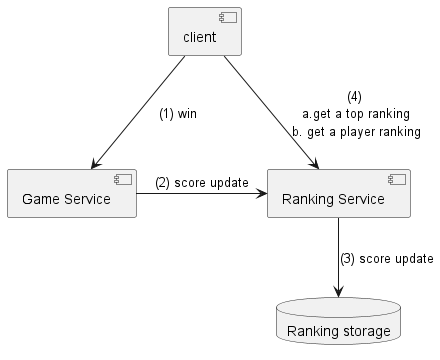

# 실시간 게임 순위표
## 1단계: 문제 이해 및 설계 범위 확정
* Q : 순위표의 점수는 어떻게 계산하나?
  * A : 사용자는 경기에서 승리하면 포인트를 얻고 이것으로 점수를 계산한다. 경기에서 이길 때마다 1점의 포인트를 추가로 획득한다.
* Q : 모든 플레이어가 순위표에 포함되어야 하는가?
  * A : 그렇다
* Q : 한 순위표는 얼마 동안이나 유효한가?
  * A : 매달 새로운 토너먼트를 시작할 때마다 만들어진다
* Q : 상위 10명의 사용자를 위한 순위표가 필요한가?
  * A : 그렇다. 추가로 특정 사용자의 순위를 순위표에 표시할 수 있어야 한다. 추가로 특정 사용자의 4순위 위 아래도 논의해보자.
* Q : 토너먼트에 참가하는 사용자는 몇 명인가?
  * A : DAU 500만, MAU 2,500만으로 가정한다.
* Q : 토너먼트 기간 동안 평균 몇 경기가 진행되는가?
  * A : 각 선수는 하루 평균 10 경기를 치른다
* Q : 점수가 같으면 순위를 어떻게 결정하는가?
  * A : 동일하다. 가능하면 동점자 간 순위를 가르는 것도 생각해보자.
* Q : 순위표는 실시간인가?
  * A : 실시간 또는 준 실시간에 가깝게 표시하자.

### 기능 요구사항
* 순위표에 상위 10명을 표시한다.
* 특정 사용자의 순위를 표시한다.
* 어떤 사용자보다 4순위 위와 아래에 있는 사용자를 표시한다.

### 비기능 요구사항
* 점수 업데이트는 실시간이다.
* 일반적인 확장성, 가용성 및 안정성 요구사항

### 개략적 규모 추정
* 24시간 동안 고르게 게임이 분포된다고 하면 초당 평균 50명의 사용자가 게임을 플레이한다(5,000,000 / 10^5초 =~ 50)
* 최대 부하는 5배로 가정하자, 초당 250명의 사용자를 감당할 수 있어야 한다.
* 하루 평균 10개의 게임을 플레이한다고 가정하면 점수를 획득하는 이벤트는 50 x 10 =~ 500, 최대 5배로 가정했으므로 500 x 5 = 2,500이다.(?)
  * > 아니지 않나?
* 상위 10명 순위표 가져오기 QPS는 각 사용자가 첫 게임을 열 때만 표시한다고 가정하면 QPS는 50이다.

## 2단계: 개략적 설계안 제시 및 동의 구하기
### API 설계
* 사용자가 게임에서 승리하면 사용자의 순위를 갱신하는 API, 게임서버의 호출로 한정된다.

* POST /v1/scores
* request : 
* ```{"user_id": "uid1234", "points": 1515}```

* GET /v1/scores
* response :
```json
{
  "data":[
    {
      "user_id" : "user_id1",
      "user_name" : "alice",
      "rank" : 1,
      "score" : 976
    },
    {
      "user_id" : "user_id2",
      "user_name" : "bob",
      "rank" : 2,
      "score" : 975
    }
  ],
  "total" : 10
}
```

* GET /v1/scores/{:user_id}
* response
```json
{
  "user_info" : {
    "user_id" : "user5",
    "score" : 940,
    "rank" : 6
  }
}
```

### 개략적 설계안


1. 사용자가 승리하면 클라이언트에서 게임 서비스에 요청을 보낸다
2. 게임 서비스는 요청을 검사하고 순위표 서비스에 점수 갱신 요청을 보낸다
3. 점수를 저장소에 저장한다
4. 클라이언트는 순위표 서비스에 직접 요청해 데이터를 가지고 온다

#### 클라이언트가 순위표 서비스와 직접 통신해야 하는가?
* 다른 대안으로 클라이언트가 점수를 정하는 방식이 있다.
* 사용자가 프락시를 설치하고 점수를 마음대로 바꾸는 중간자 공격(man in the middle attack)을 할 수 있어 보안상 안전하지 않다.

#### 게임 서비스와 순위표 서버 사이에 메시지 큐가 필요한가?
* 게임 점수가 어떻게 사용되는지에 따라 달라진다.
* 다른 곳에서도 이용되거나 여러 기능을 지원해야 한다면 카프카에 넣는 것이 합리적이다.
  * 순위표, 분석, 푸시 알림 등 여러 곳에서 동일한 데이터를 사용할 수 있기 때문이다.

### 데이터 모델
#### 관계형 데이터베이스
* 규모 확장성이 그다지 중요하지 않고 사용자 수가 많지 않다면 어떻게 하는 것이 좋을까?
* RDB를 사용할 가능성이 높다.
* 점수 변화와 조회에 필요한 CREATE, READ, UPDATE만 단순하게 처리하면 된다.
* 데이터가 많지 않을때는 효과적이지만 레코드가 수백만 개 정도로 많아지면 성능이 나빠지는 문제가 있다.
* RDB는 지속적으로 변하는 대량의 정보를 신속하게 처리할 수 없기 때문이다.
* Index와 LIMIT을 이용하여 처리할 수 있겠지만 특정 사용자의 순위를 찾기 어렵고, 순위표 하단의 사용자를 찾기도 어렵다.

#### 레디스
* 레디스는 정렬 집합을 지원한다
* 정렬 집합
  * Skip list를 두어 빠른 검색을 가능하게 하는 자료 구조
  * Sorted linked list는 O(n) 시간 복잡도로 삽입 삭제 검색을 수행할 수 있다.
  * 다단계 색인을 통해 Binary search를 구현한다.
  * 따라서 정렬 집합은 O(log(n))의 시간 복잡도를 가진다.
* 레디스 정렬 집합을 사용한 구현
  * ZADD : 기존에 없던 사용자를 집합에 삽입 또는 업데이트 한다.O(log n)
  * ZINCRBY : 점수를 지정한 만큼 증가시킨다.O(log n)
  * ZRANGE / ZREVRANGE : 특정 범위의 사용자를 가ㅣㅈ고 온다. O(log(n) + m)
  * ZRANK / ZREVRANK : 특정 사용자의 위치를 가져온다. O(log n)